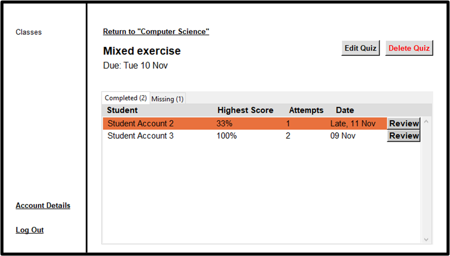
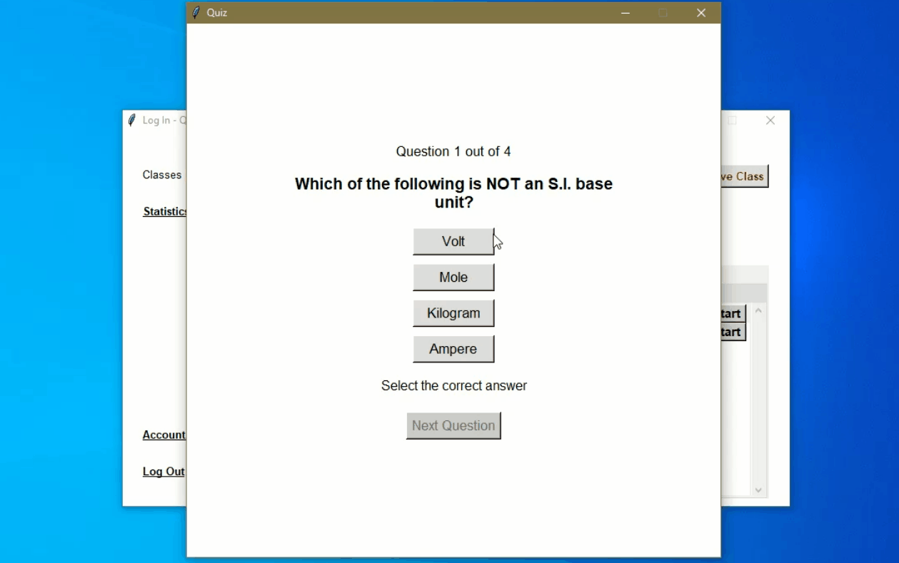

# Quiz System

_Screenshot taken using a Teacher account - Teachers can view late or missing submissions_

## About

I created this application using Python and the Tkinter GUI as part of my A-Level Computer Science coursework.

This desktop GUI-based app can be used by both teachers and students to create a connected learning experience. Teachers can use this app to provide better revision and assessment material for their students, and students can use it to help them revise and prepare for exams.

* Teachers can use this app to create virtual classes and invite students to join using a unique class code. Teachers can create their own multiple-choice questions and set assignments for their class. They can also view the results for each student and see which students have completed the assignment on time.

* Students can join many classes using the class code and complete assignments set by their teachers. They can also view their own performance on each assignment.

## Key Functionalities

* Features a login/signup system so that users can create and access their own accounts.

* Uses a class-management system to allow teachers to create/edit/delete many classes and students to join/leave many classes.

* Features a 'Question Bank' system, which allows teachers to reuse questions in different assignments.

* Generates a randomised order of questions and multiple-choice options each time a quiz is started.

* Provides real-time feedback for students when they are completing a quiz and teachers can view the results of students in their classes.

* Provides statistical information for students so that they can track their progress over time.

 

_Example Quiz Demonstration_